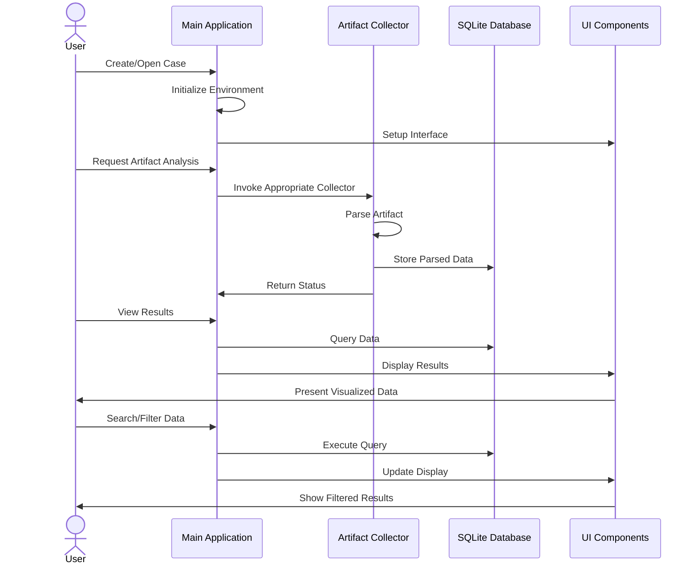
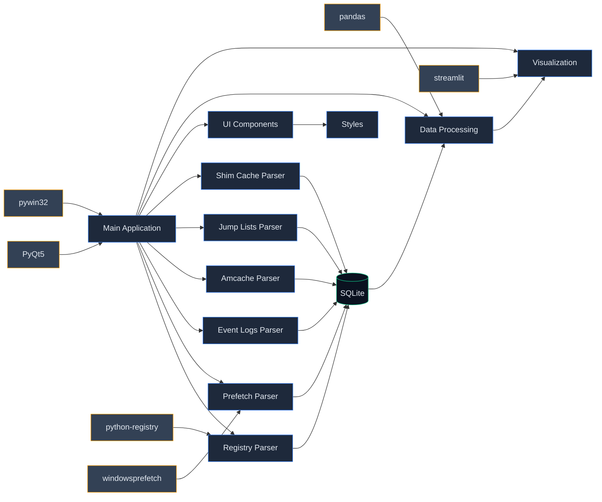

# Crow Eye Technical Documentation

## Overview

Crow Eye is an open-source Windows forensic investigation tool designed to collect, analyze, and visualize various Windows artifacts. It features a modular architecture with specialized components for artifact collection, data processing, and visualization through a cyberpunk-themed GUI.

This comprehensive documentation combines architecture information, developer guides, and technical references to provide a complete understanding of the project.

## Project Structure

```
Crow-Eye/
├── Artifacts_Collectors/       # Specialized parsers for Windows artifacts
│   ├── A_CJL_LNK_Claw.py       # Jump Lists and LNK file parser
│   ├── JLParser.py             # Jump List parser utilities
│   ├── Prefetch_claw.py        # Windows Prefetch parser
│   ├── Regclaw.py              # Windows Registry parser
│   ├── WinLog_Claw.py          # Windows Event Log parser
│   ├── amcacheparser.py        # Amcache.hve parser
│   ├── offline_RegClaw.py      # Offline Registry analysis
│   └── shimcash_claw.py        # Application Compatibility Shim Cache parser
├── data/                       # Data management components
│   ├── base_loader.py          # Base class for data loading operations
│   └── registry_loader.py      # Registry-specific data loader
├── ui/                         # UI components
│   ├── Loading_dialog.py       # Custom loading dialog
│   └── component_factory.py    # Factory for creating UI elements
├── utils/                      # Utility functions
│   ├── error_handler.py        # Error handling and logging
│   └── file_utils.py           # File operation utilities
├── GUI Resources/              # UI assets and resources
├── config/                     # Case configuration files
├── Crow Eye.py                 # Main application entry point
├── styles.py                   # UI styling definitions
└── GUI_resources.py            # Compiled UI resources
```

## Core Components

### 1. Main Application (`Crow Eye.py`)

The main application serves as the entry point and orchestrator for the entire system. It handles:

- **Environment Setup**: Creates and manages a virtual environment with required dependencies
- **UI Initialization**: Sets up the PyQt5-based user interface with cyberpunk styling
- **Artifact Collection Coordination**: Invokes the appropriate artifact collectors based on user actions
- **Data Visualization**: Displays collected artifacts in tables and other UI components
- **Case Management**: Handles case creation, loading, and configuration persistence

#### Key Functions

- `setup_virtual_environment()`: Creates and activates a Python virtual environment for Crow Eye
- `check_and_install_requirements()`: Ensures all required packages are installed
- Various event handlers for UI interactions (button clicks, menu selections, etc.)

### 2. Artifact Collectors

Each artifact collector is a specialized module for extracting and parsing a specific type of Windows forensic artifact. They follow a common pattern:

1. Locate and access the artifact source
2. Parse the binary data into structured information
3. Store results in SQLite databases for efficient querying
4. Provide JSON output for interoperability

#### Common Collector Structure

Most collectors implement these key components:

- **Data Classes**: Define the structure of parsed artifacts
- **Parser Functions**: Extract and interpret binary data
- **Database Functions**: Store parsed data in SQLite
- **Export Functions**: Generate JSON or other output formats

#### Prefetch Parser (`Prefetch_claw.py`)

##### Data Structures

```python
class Version(enum.IntEnum):
    WIN_XP_OR_2003 = 17
    VISTA_OR_WIN7 = 23
    WIN8X_OR_WIN2012X = 26
    WIN10_OR_WIN11 = 30
    WIN11 = 31

@dataclass
class Header:
    version: Version
    signature: str
    file_size: int
    executable_filename: str
    hash: str

@dataclass
class MFTInformation:
    mft_entry: int
    sequence_number: int

@dataclass
class FileMetric:
    unknown0: int = 0
    unknown1: int = 0
    unknown2: int = 0
    unknown3: int = 0
    filename_string_offset: int = 0
    filename_string_size: int = 0
    mft_info: Optional[MFTInformation] = None
```

##### Key Functions

- `parse_prefetch_file(file_path)`: Parses a Windows Prefetch file and extracts metadata
- `extract_execution_times(data, version)`: Extracts execution timestamps from Prefetch data
- `extract_file_references(data, version)`: Extracts file references from Prefetch data
- `store_prefetch_data(db_path, prefetch_data)`: Stores parsed Prefetch data in SQLite

#### Registry Parser (`Regclaw.py`)

##### Key Functions

- `parse_registry_hive(hive_path)`: Parses a Windows Registry hive file
- `extract_user_assist(registry)`: Extracts UserAssist data from Registry
- `extract_shimcache(registry)`: Extracts ShimCache data from Registry
- `extract_bam(registry)`: Extracts Background Activity Moderator data
- `store_registry_data(db_path, registry_data)`: Stores parsed Registry data in SQLite

#### Amcache Parser (`amcacheparser.py`)

##### Key Functions

- `parse_amcache(file_path)`: Parses an Amcache.hve file
- `extract_file_entries(amcache)`: Extracts file entries from Amcache
- `extract_program_entries(amcache)`: Extracts program entries from Amcache
- `store_amcache_data(db_path, amcache_data)`: Stores parsed Amcache data in SQLite

#### Jump Lists and LNK Parser (`A_CJL_LNK_Claw.py`)

##### Key Functions

- `parse_automatic_destinations(file_path)`: Parses AutomaticDestinations-MS files
- `parse_custom_destinations(file_path)`: Parses CustomDestinations files
- `parse_lnk_file(file_path)`: Parses LNK files
- `extract_target_info(lnk_data)`: Extracts target information from LNK data
- `store_jumplist_data(db_path, jumplist_data)`: Stores parsed Jump List data in SQLite

#### Event Log Parser (`WinLog_Claw.py`)

##### Key Functions

- `parse_event_log(file_path)`: Parses Windows Event Log files
- `extract_logon_events(events)`: Extracts logon events from Event Logs
- `extract_process_events(events)`: Extracts process creation/termination events
- `store_event_log_data(db_path, event_data)`: Stores parsed Event Log data in SQLite

### 3. Data Management

The `data/` directory contains components for managing data loading and processing:

#### Base Data Loader (`base_loader.py`)

##### Class: `BaseDataLoader`

```python
class BaseDataLoader:
    def __init__(self, db_path: Optional[Union[str, Path]] = None):
        self.db_path = Path(db_path) if db_path else None
        self.connection = None
        self.logger = logging.getLogger(self.__class__.__name__)
```

##### Methods

- `connect(db_path: Optional[Union[str, Path]] = None) -> bool`: Establishes a database connection
- `disconnect()`: Closes the database connection
- `execute_query(query: str, params: Tuple = (), fetch: bool = True) -> List[Dict[str, Any]]`: Executes a SQL query
- `get_table_names() -> List[str]`: Gets a list of all tables in the database
- `table_exists(table_name: str) -> bool`: Checks if a table exists in the database

#### Registry Loader (`registry_loader.py`)

##### Class: `RegistryLoader`

Extends `BaseDataLoader` with Registry-specific functionality:

- `load_registry_keys(registry_path: str) -> Dict[str, Any]`: Loads Registry keys from a hive file
- `query_registry_values(key_path: str) -> List[Dict[str, Any]]`: Queries values from a Registry key
- `store_registry_key(key_data: Dict[str, Any], table_name: str) -> bool`: Stores Registry key data in the database

### 4. UI Components

The UI is built using PyQt5 with a custom cyberpunk styling:

#### Component Factory (`component_factory.py`)

##### Class: `ComponentFactory`

```python
class ComponentFactory:
    def __init__(self, styles: Optional[Dict[str, str]] = None):
        self.styles = styles or {}
        self.logger = logging.getLogger(self.__class__.__name__)
```

##### Methods

- `create_button(text: str = "", style_name: str = "default", tooltip: str = "", icon: Optional[Union[str, QtGui.QIcon]] = None, on_click: Optional[Callable] = None) -> QtWidgets.QPushButton`: Creates a styled button
- `create_table(headers: List[str], style_name: str = "default", selection_behavior: str = "selectRows", selection_mode: str = "extended", sort_enabled: bool = True) -> QtWidgets.QTableWidget`: Creates a styled table
- Additional methods for creating other UI components

#### Loading Dialog (`Loading_dialog.py`)

##### Class: `LoadingDialog`

Custom dialog for displaying loading progress with cyberpunk styling.

### 5. Styling (`styles.py`)

Centralized styling definitions that implement the dark/cyberpunk theme:

- **Color Palette**: Defines the application's color scheme
- **Component Styles**: Provides consistent styling for UI elements
- **Animation Effects**: Defines transitions and visual effects

### 6. Utilities (`utils/`)

#### File Utilities (`file_utils.py`)

Helper functions for file operations:

- `ensure_dir_exists(dir_path: Union[str, Path]) -> Path`: Ensures a directory exists, creating it if necessary
- `read_json_file(file_path: Union[str, Path]) -> Dict[str, Any]`: Reads a JSON file and returns its contents
- `write_json_file(file_path: Union[str, Path], data: Dict[str, Any]) -> bool`: Writes data to a JSON file
- `copy_file(source: Union[str, Path], destination: Union[str, Path]) -> bool`: Copies a file from source to destination

#### Error Handler (`error_handler.py`)

Error handling and logging utilities:

- `setup_logging(log_file: Optional[Union[str, Path]] = None, level: int = logging.INFO) -> None`: Sets up logging configuration
- `handle_error(error: Exception, message: str = "", log_level: int = logging.ERROR) -> None`: Handles an error with consistent logging
- `error_decorator(func: Callable) -> Callable`: Decorator for consistent error handling in functions

## Data Flow

1. **User Initiates Analysis**: Through the GUI, the user selects artifacts to analyze
2. **Artifact Collection**: The appropriate collector module is invoked to extract data
3. **Data Storage**: Parsed artifacts are stored in SQLite databases
4. **Data Loading**: The main application loads data from databases into UI tables
5. **Visualization**: Data is presented to the user through the styled UI components

## Component Interactions

### Architecture Diagrams

#### Main Components

```mermaid
graph TD
    %% Main Components
    Main["Main Application\n(Crow Eye.py)"] --> UI["UI Components"]
    Main --> ArtifactCollection["Artifact Collection"]
    Main --> DataManagement["Data Management"]
    Main --> CaseManagement["Case Management"]
    
    %% UI Components
    UI --> Styles["Styles\n(styles.py)"]
    UI --> ComponentFactory["Component Factory\n(component_factory.py)"]
    UI --> LoadingDialog["Loading Dialog\n(Loading_dialog.py)"]
    
    %% Artifact Collectors
    ArtifactCollection --> Amcache["Amcache Parser\n(amcacheparser.py)"]
    ArtifactCollection --> Prefetch["Prefetch Parser\n(Prefetch_claw.py)"]
    ArtifactCollection --> Registry["Registry Parser\n(Regclaw.py)"]
    ArtifactCollection --> OfflineRegistry["Offline Registry\n(offline_RegClaw.py)"]
    ArtifactCollection --> EventLogs["Event Logs\n(WinLog_Claw.py)"]
    ArtifactCollection --> JumpLists["Jump Lists & LNK\n(A_CJL_LNK_Claw.py)"]
    ArtifactCollection --> ShimCache["Shim Cache\n(shimcash_claw.py)"]
    
    %% Data Management
    DataManagement --> BaseLoader["Base Loader\n(base_loader.py)"]
    DataManagement --> RegistryLoader["Registry Loader\n(registry_loader.py)"]
    DataManagement --> SQLite[("SQLite Databases")]
    
    %% Case Management
    CaseManagement --> ConfigFiles[("JSON Config Files\n(config/)")]
    
    %% Utilities
    Main --> Utils["Utilities"]
    Utils --> FileUtils["File Utilities\n(file_utils.py)"]
    Utils --> ErrorHandler["Error Handler\n(error_handler.py)"]
    
    %% Data Flow
    Amcache --> SQLite
    Prefetch --> SQLite
    Registry --> SQLite
    OfflineRegistry --> SQLite
    EventLogs --> SQLite
    JumpLists --> SQLite
    ShimCache --> SQLite
    
    SQLite --> Main
    
    %% Styling
    Styles --> UI
    
    %% User Interaction
    User(("User")) --> Main
    Main --> User
    
    %% Class Definitions
    classDef mainApp fill:#0F172A,stroke:#00FFFF,stroke-width:2px,color:#E2E8F0
    classDef component fill:#1E293B,stroke:#3B82F6,stroke-width:1px,color:#E2E8F0
    classDef collector fill:#1E293B,stroke:#8B5CF6,stroke-width:1px,color:#E2E8F0
    classDef data fill:#0B1220,stroke:#10B981,stroke-width:1px,color:#E2E8F0
    classDef utility fill:#1E293B,stroke:#F59E0B,stroke-width:1px,color:#E2E8F0
    classDef user fill:#334155,stroke:#00FFFF,stroke-width:2px,color:#E2E8F0
    
    %% Apply Classes
    class Main mainApp
    class UI,ComponentFactory,LoadingDialog,Styles component
    class Amcache,Prefetch,Registry,OfflineRegistry,EventLogs,JumpLists,ShimCache collector
    class SQLite,BaseLoader,RegistryLoader,DataManagement,ConfigFiles data
    class Utils,FileUtils,ErrorHandler utility
    class User user
    class ArtifactCollection collector
    class CaseManagement data
```



#### Component Interaction Flow



#### Module Dependencies



### Component Interaction Details

#### Main Application → Artifact Collectors

The main application interacts with the artifact collectors in the following ways:

1. **Initialization**: The main application imports the collector modules
   ```python
   import Artifacts_Collectors.Prefetch_claw as Prefetch_claw
   import Artifacts_Collectors.offline_RegClaw as offline_RegClaw
   import Artifacts_Collectors.WinLog_Claw as WinLog_Claw
   import Artifacts_Collectors.A_CJL_LNK_Claw as A_CJL_LNK_Claw
   import Artifacts_Collectors.JLParser as JLParser
   import Artifacts_Collectors.Regclaw as Regclaw
   ```

2. **Invocation**: When the user requests artifact collection, the main application calls the appropriate collector functions
   ```python
   # Example: Collecting Prefetch artifacts
   Prefetch_claw.collect_prefetch_artifacts(source_path, output_db_path)
   ```

3. **Progress Monitoring**: The main application monitors the progress of artifact collection and updates the UI accordingly

#### Artifact Collectors → Data Storage

The artifact collectors interact with data storage (SQLite databases) in the following ways:

1. **Database Creation**: Collectors create SQLite databases to store parsed artifacts
   ```python
   # Example: Creating a database connection
   conn = sqlite3.connect(db_path)
   cursor = conn.cursor()
   ```

2. **Schema Definition**: Collectors define the database schema for their artifacts
   ```python
   # Example: Creating a table for Prefetch files
   cursor.execute('''
   CREATE TABLE IF NOT EXISTS prefetch_files (
       id INTEGER PRIMARY KEY,
       filename TEXT,
       executable TEXT,
       hash TEXT,
       last_run_time TEXT,
       run_count INTEGER
   )
   ''')
   ```

3. **Data Insertion**: Collectors insert parsed artifact data into the database
   ```python
   # Example: Inserting Prefetch file data
   cursor.execute('''
   INSERT INTO prefetch_files (filename, executable, hash, last_run_time, run_count)
   VALUES (?, ?, ?, ?, ?)
   ''', (filename, executable, hash_val, last_run_time, run_count))
   ```

#### Main Application → Data Loaders

The main application interacts with data loaders in the following ways:

1. **Initialization**: The main application creates instances of data loaders
   ```python
   # Example: Creating a BaseDataLoader instance
   from data.base_loader import BaseDataLoader
   loader = BaseDataLoader(db_path)
   ```

2. **Data Retrieval**: The main application uses data loaders to retrieve data from databases
   ```python
   # Example: Executing a query to retrieve Prefetch data
   prefetch_data = loader.execute_query("SELECT * FROM prefetch_files")
   ```

3. **Data Processing**: The main application processes the retrieved data for display or analysis

#### Main Application → UI Components

The main application interacts with UI components in the following ways:

1. **Component Creation**: The main application creates UI components using the ComponentFactory
   ```python
   # Example: Creating a table for displaying Prefetch data
   from ui.component_factory import ComponentFactory
   factory = ComponentFactory(CrowEyeStyles.STYLES)
   prefetch_table = factory.create_table(["Filename", "Executable", "Last Run Time", "Run Count"])
   ```

2. **Data Display**: The main application populates UI components with data
   ```python
   # Example: Populating a table with Prefetch data
   for row_idx, prefetch_file in enumerate(prefetch_data):
       prefetch_table.insertRow(row_idx)
       prefetch_table.setItem(row_idx, 0, QtWidgets.QTableWidgetItem(prefetch_file["filename"]))
       prefetch_table.setItem(row_idx, 1, QtWidgets.QTableWidgetItem(prefetch_file["executable"]))
       prefetch_table.setItem(row_idx, 2, QtWidgets.QTableWidgetItem(prefetch_file["last_run_time"]))
       prefetch_table.setItem(row_idx, 3, QtWidgets.QTableWidgetItem(str(prefetch_file["run_count"])))
   ```

3. **Event Handling**: The main application connects UI events to handler functions
   ```python
   # Example: Connecting a button click to a handler function
   collect_prefetch_button.clicked.connect(self.on_collect_prefetch_clicked)
   ```

## Development Workflows

### Adding a New Artifact Parser

To add support for a new Windows artifact:

1. Create a new parser file in the `Artifacts_Collectors/` directory
2. Implement the necessary data classes and parsing functions
3. Add database storage functionality
4. Integrate with the main application by adding UI elements and event handlers
5. Update the case management system to include the new artifact type

### Enhancing the UI

To improve the user interface:

1. Use the `ComponentFactory` class to create new UI elements
2. Follow the cyberpunk styling guidelines in `styles.py`

### Future Enhancements


- Development of a correlation engine for Windows Artifacts
- Enhancements to the search dialog
- Improvements to the visualization timeline
- AI integration for querying, searching, summarizing, and assisting non-technical users
3. Ensure responsive design and proper error handling

### Improving Data Correlation

To enhance artifact correlation:

1. Identify common attributes across artifacts
2. Implement correlation rules in the correlation engine
3. Update the UI to display correlated data

## Key Features

### Case Management

Crow Eye implements a case-based workflow:
- Cases can be created, opened, and managed
- Case configurations are stored as JSON in the `config/` directory
- The last opened case is tracked for convenience

### Artifact Correlation

The application correlates evidence across different artifacts:
- Execution evidence is cross-referenced between Prefetch, Amcache, and Registry
- Timestamps are compared to identify potential anomalies
- Related artifacts are linked for comprehensive analysis

### Cyberpunk UI

The interface features a distinctive dark/cyberpunk theme:
- Dark backgrounds with neon accents
- Custom-styled tables, buttons, and dialogs
- Animated components for visual feedback

## Technical Implementation

### Dependencies

Crow Eye relies on several key libraries:
- **PyQt5**: For the graphical user interface
- **python-registry**: For parsing Windows Registry hives
- **pywin32**: For Windows-specific functionality
- **pandas**: For data manipulation
- **streamlit**: For additional visualization capabilities
- **windowsprefetch**: For prefetch file parsing

### Database Schema

Each artifact type has its own database schema optimized for the specific data it contains. For example, the Amcache parser uses tables like:
- InventoryApplication
- InventoryApplicationFile
- InventoryDriverBinary
- DeviceCensus

## Extension Points

Crow Eye is designed for extensibility:

1. **New Artifact Collectors**: Additional collectors can be added to the `Artifacts_Collectors/` directory
2. **UI Enhancements**: The component factory pattern allows for consistent UI expansion
3. **Visualization Methods**: New visualization techniques can be integrated through the existing framework

## Deployment Considerations

- Requires administrator privileges on Windows systems
- Uses a virtual environment for dependency isolation
- Supports both live system analysis and offline artifact examination

## For AI Agents

If you're an AI agent working on Crow Eye, here are some tips:

1. **Understanding the Codebase**:
   - Start with the architecture documentation to understand the overall structure
   - Examine the main application file (`Crow Eye.py`) to understand the entry point
   - Look at specific artifact collectors to understand parsing logic

2. **Making Enhancements**:
   - Follow the modular architecture when adding new features
   - Maintain the cyberpunk styling for UI components
   - Ensure proper error handling and logging
   - Add comprehensive documentation for new components

3. **Testing Changes**:
   - Test with different Windows versions (7/10/11)
   - Verify artifact parsing with known test files
   - Check UI rendering on different screen sizes
   - Validate database operations and data integrity

## Roadmap and Future Development

Planned enhancements for Crow Eye include:

- MFT table parsing for file system metadata
- Registry binary data decoding (UserAssist, ShellBags)
- Enhanced LNK file and Jump list structure parsing
- Advanced visualization of artifact timelines
- Reporting functionality for exporting findings